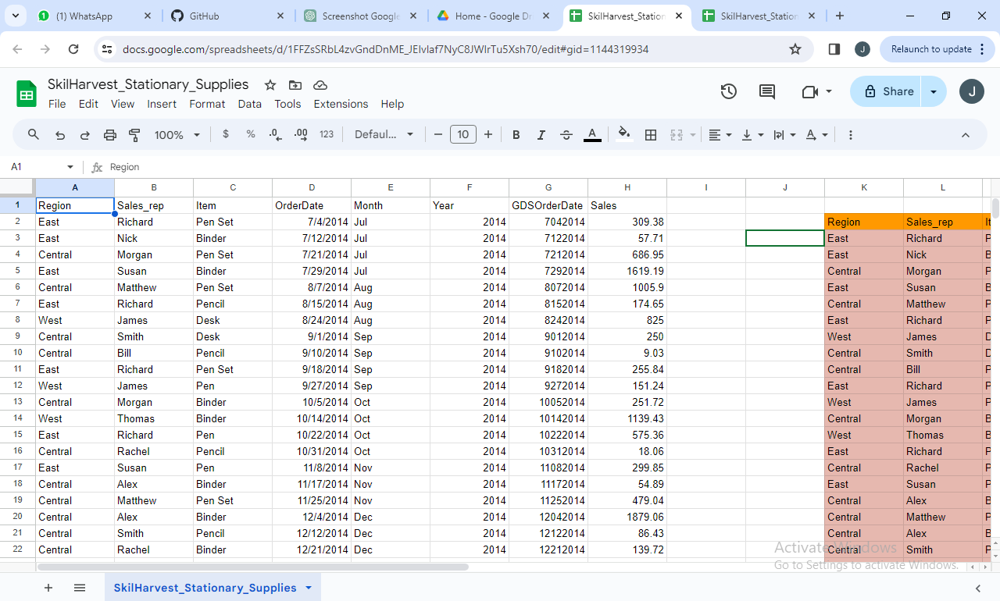
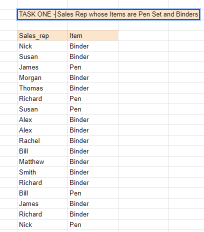
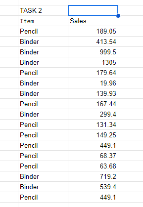
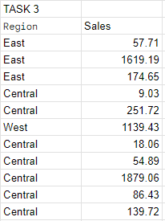
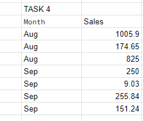
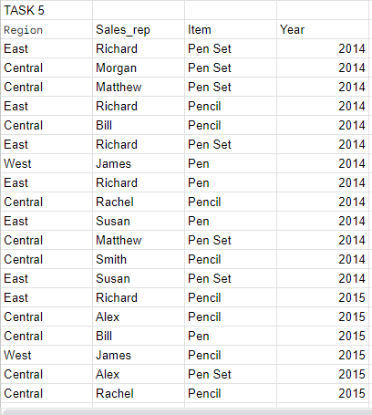
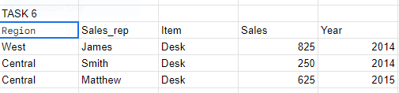

#  <p align="center"/>SKILL HARVEST DATA ANALYSIS BOOTCAMP</p>


###  INTRODUCTION
This repository is an archive of my learning journals during the data analysis training bootcamp with skill harvest Academy. Below, is a curated list of the bootcamp contents:
1. Spreadsheet Fundamentals(microsoft Excel & Google Sheets)-[Download Here](https://www.microsoft.com/en-ng/)
2. Github Fundamentals- [Create your account](https://github.com/)
3. PowerQuery- [Download Here](https://www.microsoft.com/en-us/download/details.aspx?id=39379&CorrelationId=50f8dd04-db7e-4eb7-9096-e2bd03a44d13)
4. Introduction to powerBI- [Watch tutorials Here](https://www.youtube.com/watch?v=fnA-_iDV_LY&list=PLoyECfvEFOjaMKFbBSKSmnOpEcXqqRegW)

##  1.0  Spreadsheets Fundamentals

Spreadsheets are powerful tools used for organizing,analysis, and presenting data in a structured format. They consist of rows and columns, forming a grid where data can be entered, manipulated,and calculated.

They play a crucial role in various aspect of business, education, and personal organization. Hence understanding their features and capabilities can significantly enhance productivity and decision-making processes.

-   Major types: Microsoft & Google sheets
-   Key Features: organization, calculation, Data analysis, visualization and collaboration.
-   Common uses: financial management,data tracking, Analysis & reporting, and Decision making.
-   Differences

|Feature|Microsoft Excel|Google sheet|
|-|-|-|
|Ownership|Requires installation & licenses|Cloud-based accessible online|
|Cost|Paid softwares, licenses  required|free basic features, paid options|
|functionalities|Advanced data analysis tools|Basic to intermediate capabilities|
|Collaboration|limited collaboration features|Robust real-time collaboration capabilities|


##  2.0  GITHUB FUNDAMENTALS

A. Here, we were introduced to github as a/an:
-   version control and collaboration tool
-   open source
-   learning resources.

B.  How to create a github account.

C.  How to create a repository.

D.  how to develop a github project Readme file. 


##  3.0  POWER QUERY

Here, we use skillharvest_stationary_supplies.csv to demonstrate the use case of some power query functions. Below is an excerpt from the datasheet.

## <p align="center"/>EXCERPT FROM THE DATASHEET</p>

#  <div align="center">
   
   </div>

###   3.1   <p align="center">POWER QUERY EXERCISE</p>
1.   Show sales Rep whose Items are Pen Set and Binders.
2.   Show sales of binder items and pencil in 2015.
3.   Show sales in Central and East region in 2014.
4.   Show sales in August and September 2014.
5.   Show sales of items that start with Pen, include their region, sales rep and year.
6.   Show sales of items that end with ‘sk’, include their region, sales rep and year.

##   <p align="center">TASK ONE</p>

```
PowerQuery
=QUERY(A1:H44,"SELECT B,C WHERE C='Pen' OR C='Binder'",1)
```
#  <div align="center">  </div>

##   <p align="center">TASK TWO</p>

```
PowerQuery
=QUERY(A1:H44,"SELECT C,H WHERE (C='Pencil' OR C= 'Binder') AND F=2015",1)
```
#  <div align="center">
   
   </div>

##   <p align="center">TASK THREE</p>
   
```
PowerQuery
=QUERY(A1:H44,"SELECT E,H WHERE (E='Aug' OR E='Sep') AND F=2014",1)
```
#  <div align="center">
   
   </div>
   
##   <p align="center">TASK FOUR</p>
 
```
PowerQuery
  =QUERY(A1:H44,"SELECT E,H WHERE (E='Aug' OR E='Sep') AND F=2014",1) 
```
#  <div align="center">
   
   </div>
   
##   <p align="center">TASK FIVE</p>
 
```
PowerQuery
=QUERY(A1:H44,"SELECT A,B,C,F WHERE C LIKE 'Pen%'",1)
```
#  <div align="center">
   
   </div>

##   <p align="center">TASK SIX</p>
   
```
PowerQuery
=QUERY(A1:H44,"SELECT A,B,C,H,F WHERE C LIKE '%sk'",1)
```

#  <div align="center">
   
   </div>

#   4.0   INTRODUCTION TO POWERBI
###   INTRODUCTION
PowerBi is a data visualisation and business intelligent tool that converts data from different data sources to inter active dashboard and Bi reports. it is a collection of software services, appand connectors that work together to turn your unrelated source of data to coherent, visually immersivenand interactive insights.

PowerBi suites provides multiple software connector and services such as

- PowerBi desktop
- PowerBi services- This is based on SMS.
- PowerBi mobile apps- This is available for different platforms.
Generally, this set of service is used by business users to consume data and build business intelligent reports.

##   COMPONENTS OF POWERBI
-   PowerBi desktop- This is used to create reports and data visualization on the dataset.
-   PoweBi gateway- it is used to keep data by connecting to on-premises data source without the need to move the data it allows you to query large datasets and benefit from the existing investments.
-   PowerBi mobile apps- Using powerBi mobile apps, you can stay connected to data from anywhere. powerBi apps are available for windows,ios, and android platform.
-   PowerBi services- this is a cloud service and is used to publish powerBi reports and data visualization.
##   SUPPORTED DATA SOURCES
PowerBi supports large range of data sources. you can click on Get data and ti will show you all the available data cconnections. The following are the available data source in powerBi

-   Flat Files
-   SQL database
-   OData feed
-   Blank query
-   Azure cloud platform
-   Online services
-   Blank Query
-   other data sources such as Hadoop, exchange or active directory.
##   POWERBI COMPARISON WITH OTHER BI TOOLS
There are many business intelligent tools such as tableau, powerBi and SSRS among others but a major competitive value as a result of market evaluation exist between powerBi and tableau and some of the argument are highlighted below.

|Features|Tableau|PowerBi|
|-|-|-|
|Data visualization|Tableau provide strong data visualization and is one of the main visualization tools in the market|powerBi provide a strong backend data manipulation feature with access to simple visualizations|


